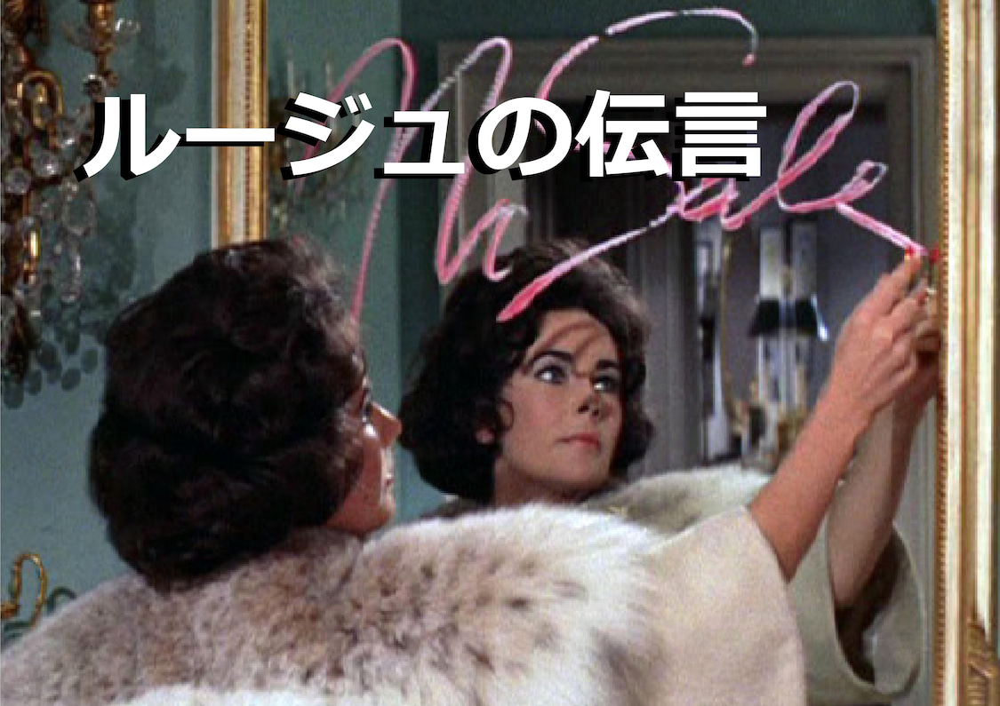

# Message in Rouge - Yumi Arai

[ルージュの伝言](https://www.youtube.com/watch?v=eqdi6Px_RoY)

[https://open.spotify.com/track/1jw992uwXhqJJ0H42ucTRL?si=64JYbxZzTzqWJ_mW_OUUMg&context=spotify%3Aalbum%3A5q4nqytaxLA99VEVJ6yQRu](https://open.spotify.com/track/1jw992uwXhqJJ0H42ucTRL?si=64JYbxZzTzqWJ_mW_OUUMg&context=spotify%3Aalbum%3A5q4nqytaxLA99VEVJ6yQRu)

*The song’s lyrics show a girl’s actions after finding out that her boyfriend cheated. What’s surprising is the fact that this girl is off on a journey to tell her boyfriend’s mother about the incident! (Yuming is the only one that can make these lyrics work.)*

** 

**ENGLISH**

I’m on a train by myself right now

To meet his momma

In the corner of my eye as twilight draws near,

I see the houses along the street and a stream of cars whizzing by

Right about now he’ll be noticing

The message in rouge in the bathroom

I’m not going back home

Unless he quits being unfaithful to me

Still feeling nervous,

The *Ding-Dongs* in town fading into the distance

Tomorrow morning his momma’s gonna

Scold him over the phone, *My Darling!*

Right about now he’ll be confused

About the message in rouge in the bathroom

I wonder if he’ll ask all his friends

About where I am

Still feeling nervous,The *Ding-Dongs* in town fading into the distance

Tomorrow morning his momma’s gonna

Scold him over the phone, *My Darling!*

Scold him over the phone, *My Darling!*

---

**Kanji**

あのひとのママに会うために

今 ひとり列車に乗ったの

たそがれせまる街並や車の流れ

横目で追い越して

あのひとはもう気づくころよ

バスルームにルージュの伝言

浮気な恋をはやくあきらめないかぎり

家には帰らない

不安な気持を残したまま

街は ding-dong 遠ざかってゆくわ

明日の朝ママから電話で

しかってもらうわ my darling!

 (my little darling, my little darling)

あのひとはあわててるころよ

バスルームにルージュの

伝言てあたりしだい友達に 

たずねるかしら

私の行く先を不安な気持を残したまま

街は ding-dong 遠ざかってゆくわ

明日の朝ママから電話で

しかってもらうわ my darling!

しかってもらうわ my darling!

(My little darling, my little darling)(My little darling, my little darling)

(My little darling, my little darling)(My little darling, my little darling)

(My little darling, my little darling)(My little darling, my little darling)

**ROMAJi**

ano hito no mama ni au tame ni

ima hitori ressha ni notta no

tasogare semaru machinami ya kuruma no nagare

yokome de oikoshite

ano hito wa mou kidzuku koro yo

basuru-mu ni ru-ju no dengonu

waki na koi wo hayaku akiramenai kagiri

uchi ni kaeranai

fuan na kimochi wo nokoshita mama

machi wa Ding-Dong toozakatte yuku wa

asu no asa mama kara denwa de

shikatte morau wa My Darling!

ano hito wa awatete'ru koro yo

basuru-mu ni ru-ju no dengonteatarishidai tomodachi ni tazuneru kashirawatashi no yukusaki wo

fuan na kimochi wo nokoshita mama

machi wa Ding-Dong toozakatte yuku wa

asu no asa mama kara denwa de

shikatte morau wa My Darling!

shikatte morau wa My Darling!

> **Collected from**:
[https://www.kawaiikakkoiisugoi.com/tbt-rouge-no-dengon/31771/](https://www.kawaiikakkoiisugoi.com/tbt-rouge-no-dengon/31771/)
[https://kimonobeat.tumblr.com/post/87073723448/matsutoya-yumi-lyrics-rouge-no-dengon](https://kimonobeat.tumblr.com/post/87073723448/matsutoya-yumi-lyrics-rouge-no-dengon)
>